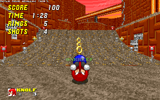

## Snolf Robo Blast 2

Snolf character mod for Sonic Robo Blast 2 that allows you to play it like golf.
Snolf cannot move normally and controls like a golf game. Aim with the camera
and use the jump button to start charging a shot. Use the jump button again to
time your shot power.

## Installation

Download and install [Sonic Robo Blast 2].

Download the Snolf WAD file. See the Sonic Robo Blast 2 wiki for [how to load a
WAD file]. Snolf will appear as a separate character in the character select
menu.

Sonic Robo Blast 2 does not allow saving with addons loaded by default. In order
to enable saving use [V_customsave-v1.soc].

[Sonic Robo Blast 2]: https://www.srb2.org/
[how to load a WAD file]: https://wiki.srb2.org/wiki/WAD_file#Loading_WAD_files
[V_customsave-v1.soc]: https://mb.srb2.org/showthread.php?t=45730

## Gameplay

Snolf cannot move or jump like a normal character. They can only move via the
power of golf.

**Swing:** Aim with the camera and use the Jump button to time your shots'
horizontal and vertical power.

You can hold the forward button when you press Jump to charge vertical power
first and you can hold back to shoot after only charging a single axis.

You can hold the Jump button to brake while rolling.

**Mulligan:** Hold the Spin button to undo your last shot. Use this if you get
stuck.

*Tip:* If the camera is getting caught on a wall use first person view to aim.

You must come to a full stop before you can take your next shot, so choose each
shot wisely. Because Snolf can be very difficult to control they have infinite
lives. Snolf is also immune to the spinning fire jets in Red Volcano Zone.

### Control rebinding

The mulligan button can also be rebound in the console with the following:
* `snolf_mulligan_button spin`
* `snolf_mulligan_button jump`
* `snolf_mulligan_button ca1`
* `snolf_mulligan_button ca2`
* `snolf_mulligan_button ca3`
* `snolf_mulligan_button off`

### Boss mode

When fighting a boss Snolf gets some extra leeway. Against a boss you can take a
shot after touching the ground (even if you bounce or roll), after hitting the
boss or after getting hit by the boss. Bosses also drop six rings when hit.
These features can be toggled off if you prefer (see commands section below).

### Everybody's Snolf

Snolf isn't just for Snolf. With Everybody's Snolf everybody can snolf. Use the
`everybodys_snolf` command to get everyone in on the fun. It even works with
characters from other addons, but I can't guarantee it won't break anything.

### Shot guide

If you want some help with aiming your shots you can use the `snolf_shot_guide`
command to enable a targetting system.

### Save states

To help even more, if `snolf_save_states` is enabled then you save and load the
player state with the custom action buttons. Custom action 1 saves the current
player state, custom action 2 loads a state and custom action 3 undoes the last
save state. The player state includes the player position, momentum, ring count
and shot charge. This is not a full save state like you would have in an
emulator. It only affects the player and can't be used between dying and
respawning.

## Commands

In addition to the ones mentioned above there are many commands provided to
let you customise Snolf. Generally commands can be toggled on or off by calling
them without any argument or can be called followed by `on` or `off`.

In multiplayer games these settings affect all players, can only be used by
admins, and are announced in chat when activated.

Commands listed have their default value listed after them in square brackets.

### Boss settings

* `snolf_shot_on_hit_boss` [on]: Take a shot immediately after hitting a boss
* `snolf_shot_on_hit_by_boss` [on]: Take a shot after getting hit by a boss
* `snolf_rings_on_hit_boss` [on]: Bosses drop rings on hit
* `snolf_shot_on_touch_ground_when_in_boss` [on]: When fighting a boss Snolf can
take a shot immediately after touching the ground
* `snolf_shot_on_touch_wall_when_in_boss` [off]: When fighting a boss Snolf can
take a shot immediately after touching the ground

### Everybody's Snolf

* `everybodys_snolf` [off]: Force all characters to control like Snolf.

### Other gameplay settings

* `snolf_hud_mode` [on]: Alters the life count section of the heads up display
to reflect if infinite lives is enabled and alterters character names if
Everybody's Snolf is enabled. Can also be set to `2` in to disable the life
counter entirely.
* `snolf_inf_lives` [on]: Extra life is refunded on death
* `snolf_fire_shield` [on]: Protects from spinning fire jets in Red Volcano
* `snolf_shot_guide` [off]: Display a shot guide to help aim
* `snolf_save_states` [off]: Enables save states with the custom action buttons
* `snolf_inf_air` [off]: No drowning in water or space
* `snolf_inf_rings` [off]: Ring count forced to 999
* `snolf_ground_control` [off]: Enable steering on the ground
* `snolf_death_mulligan` [off]: Return to last resting place on death
* `snolf_air_shot` [off]: Shots can be taken in the air

## Credits

Snolf Robo Blast 2 by [Caoimhe Ní Chaoimh].

Inspired by the original Snolf ROM hacks by [Melon].

Character portrait by [Mike Tona].

Made using the [Sonic Robo Blast 2 Character Preset] by Blu The Hedgehog.

Life count icon from Mario Golf: Advance Tour.

[Caoimhe Ní Chaoimh]: https://oakreef.ie/
[Melon]: https://melon.zone/
[Mike Tona]: https://miketona.carrd.co/
[Sonic Robo Blast 2 Character Preset]: https://gamebanana.com/skins/181950

## Changelog

v2.22
* Snofl can mulligan out of minecarts without dying
* The mulligan hint is no longer displayed when Snolf is on any ridable object

v2.21
* Snolf can mulligan out of objects the player attaches to like rollout rocks or
swings

v2.20
* The mulligan hint is no longer displayed when Snolf is on a waterslide or
rollout rock

v2.19
* You can now hold down when shooting to only drive along one axis
* Stop life count from going below 2 so retry can always be used from the menu

v2.18
* Added braking
* Snolf leaves a default thok particle train instead of dust again

v2.17
* Changed how Milne dance and Cross Momentum faceplant states are checked

v2.16
* Fixed some issues with Kirby's Golf ability

v2.15
* Made changes to accomidate X Momentum
* Added X Momentum faceplant sprites
* Added Kirby copy ability to Snolf: Golf
* Added Milne dancing sprites
* Snolf physics no longer interfere with Nack's bounce or Gemma's slam
* Golfing characters are forced into a roll state less often
* Reworked some features to only apply to Snolf, even in Everybody's Snolf mode
* Golfers no longer bounce off walls while on a waterslide
* Save state system now saves and loads object and player flags
* Added onscreen hint about using a mulligan if the player hasn't been able to
take a shot for ten seconds
* snolf_inf_lives is now reflected in the life counter in the head's up display
* Renamed command everybodys_snolf_name_override to snolf_hud_mode
* Added snolf_mulligan_button command to let players set their mulligan button
* Fixed Everybody's Snolf mode still allowing normal movement sometimes
* Fixed bug with input handling
* Fixed roll animation playing too quickly

v2.14
* Improved compatibility with mods that alter character stats like X Momentum

v2.13
* Sync variables when joining multiplayer games
* Fix issue where Snolf players could get stuck on each other
* Fix issue where Snolf would get stuck on the edge of a conveyor belt

v2.12
* Shield and air abilities (thok, etc.) can no longer be used after bouncing
* Change text highlight colours on character select screen

v2.11
* New signpost/save file sprite
* Changed character select colour scheme
* Snolf now leaves a dust trail when rolling
* Updated the on death hook to only run for player objects
* Check for SF_MACHINE flag when calculating character weights

v2.10
* Added shot guide that can be activated with snolf_shot_guide
* Added the ability to  charge vertical shot power first by holding forward when
pressing jump
* Disable jump inputs while taking a shot so other characters abilties don't
interfere with Everybody's Snolf
* Adjustments to how names are set in Everybody's Snolf
* Prevent mulligan points from being set when moving on a coveyor belt
* Fixed sounds not playing from the right source
* Fixed Snolf being able to take a shot after bouncing on the ground with no
horizontal momentum

v2.9
* Player state is no longer forced to S_PLAY_ROLL in NiGHTS mode, if player
sprite is set to SPR_NULL or for non-Snolf characters during death animation

v2.8
* Egg Colosseum throws rings further than other bosses
* Fixed jump being enabled when taking a mulligan

v2.7
* Bosses only drop rings if a player is playing as Snolf
* Snolf is immune to spinning flame jets (toggleable with command)
* Infinite lives is enabled by default
* Added save state system
* Commands print to the normal console again as well as the multiplayer chat log
* Added Metal Snolf
* Fixed boss mode triggering on Egg Rock Zone Act 2
* Fixed not being able to turn off snolf_shot_on_hit_by_boss
* Fixed Snolf being able to jump while bouncing off the ground

v2.6
* The angle of rings dropped by bosses now depend on where the boss is facing
* Added NiGHTS sprites
* Adjust weight assigned to certain characters for collisions
* Added sound effect when players bounce off each other
* Removed quick turn from custom action 1

v2.5
* Snolf can jump off rollout rocks again
* Bosses drop rings when hit
* Changed boss mechanics to work for any level that contains a boss object, not
just hardcoded levels
* Added commands to toggle Snolf boss mechanics
* Allow commands to be called with arguments "on", "off", "true" and "false"

v2.4
* Allow Snolf to take a shot after getting hit by a boss
* Allow Snolf to take a shot after bouncing off a wall when in a boss level
* Changed mulligan point to be set whenever the player is at rest regardless of
of current player state
* Level music resumes when enabling infinite air command while drowning

v2.3
* Allow Snolf to take a shot immediately after hitting a boss
* Allow Snolf to take a shot after bouncing off the ground when in a boss level
* Allow Snolf to take a shot after skimming over water when in a boss level
* Restored spindash behaviour for charging shots

v2.2
* Fixed Snolf bouncing off steep slopes like quarter- and half-pipes instead of
going off them as expected
* Changed how characters with 0 jumpfactor are handled in collisions

v2.1
* Fixed commands displaying an unhelpful error message instead of the correct
help message if used with the wrong arguments
* Fix everybodys_snolf_name_override help message displaying for all users
instead of just the user trying to use the command

v2.0
* Complete rewrite of Lua script using coroutines, metatables and instance
methods to streamline the code
* Large second rewrite of Lua script when I realised that coroutines, metatables
and instance methods were incompatible with netplay
* Snolf players can now collide with each other
* Snolf can skim along the surface of water
* Time it takes to mulligan reduced to one second
* Replaced modifier input method with console commands
* Added air snolf command
* Replaced Everybody's Snolf WAD with a console command
* Removed idle animation sprites
* Stopped Snolf bouncing on the ground when doing the death animation

v1.6
* Adjusted alignment of constellation sprites
* Shot charge rate is doubled in certain maps

v1.5
* Super Snolf can take shoots mid-air and has a doubled shot charge rate
* Super Sneakers double shot charge rate
* Snolf can take shots mid-"air" when in space
* Snolf can take shots mid-air in certain maps
* Shot charge rate is doubled on a certain map

v1.4
* New character select art by Mike Tona
* Fixed errors with spectator players in multiplayer
* Taking a mulligan adds to the shot total
* Shots and mulligans while free roaming after finishing a level in multiplayer
are not counted towards total
* Shots HUD element is disabled after completing a level in multiplayer
* Modifiers are announced in chat
* Renamed cheats to modifiers in readme
* Added warning about conveyor belts to readme
* Removed Super Sonic and NiGHTS sprites from WAD

v1.3
* Fixed Snolf breaking netplay games

v1.2
* Changed how Snolf mode was being checked to fix potential error messages when
using Everybody's Snolf
* Added new continue icon
* Added constellation sprites
* Copied rolling animations over walking animations so that Snolf is
distinguishable from Sonic in the multiplayer character select screen
* Copied rolling animations to continue screen animations so Snolf is still in a
ball on the continue screen
* Added controls and known issues to readme

v1.1

* Added infinite rings cheats
* Added flag to allow other skins to be forced into Snolf controls
* Added small mini WAD to force Snolf controls on all characters
* Added description of cheats to readme
* Added tip about first person view to character select screen
* Mulligan point list is cleared on death (unless return to mulligan point cheat
is enabled)
* Mulligan point list is cleared on map change
* Shot is reset on death, map change or while touching a slide
* Moved shots tracker under the ring count and styled to be similar
* Made new HUD elements display consistently on different resolutions
* At-rest check now checks vertical momentum as well
* Teleport sound no longer plays if resetting to last mulligan point on death
with cheat

v1.0
* Snolf now rebounds off walls and floors
* Snolf can now revert to previous resting spots with the mulligan
* Added cheats
* Instead of setting forcing PF_JUMPSTASIS Snolf's jumpfactor stat is changed
based on situation to allow certain level features to work
* Lots of refactoring

v0.5

* Added Quick Turn ability if spin button is tapped
* Relaxed Mulligan conditions to prevent potential softlocks
* Charging a shot now counts as a spindash and allows player to activate
spindash switches
* Snolf's code no longer blocks player input allowing several previously broken
mechanics to work
* Force PF_JUMPSTASIS flag to 1 as the new way of preventing Snolf from jumping
* Set Snolf's speed and acceleration to 0 as the new way of preventing Snolf
from moving
* Added checks to allow player control when on a waterslide
* Updated character select text
* Code cleanup
* Every level in the main story mode should now, in theory, be completable

v0.4
* Power meter now moves sinusoidally instead of linearlly
* Mulligan disallowed if stationary
* Re-enabled control for NiGHTS mode
* Added custom graphics for power meter
* Added custom graphics for character select, signpost, extra life and life
count
* Added warning that levels may not be beatable and credit for life count icon
to readme

v0.3
* Added shot counters
* Mulligan resets player's momentum on the Z axis
* Shot Z thrust is no longer relative to existing Z momentum
* Added basic visual charge meters
* Removed print statements
* Increased rate the charge builds
* Moved variables to player.snolf table to reduce risk of conflict with other
mods

v0.2
* Snolf no longer swallows inputs for the spin button or custom action buttons
* Snolf now is set to a jump state when launched, allowing them to use shield
abilities
* Snolf can take a mulligan, hold the spin button to reset to last stationary
position
* Snolf must come to a rest before a new shot can be taken
* Added character select text
* Changed character select colours

v0.1
* Initial Snolf
