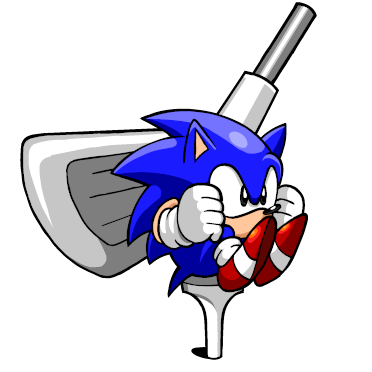

## Snolf Robo Blast 2

Snolf character mod for Sonic Robo Blast 2 that allows you to play it like golf.
Snolf cannot move normally and controls like a golf game. Aim with the camera
and use the jump button to start charging a shot. Use the jump button again to
time your shot power.

## Installation

Download and install [Sonic Robo Blast 2].

Download the Snolf WAD file. See the Sonic Robo Blast 2 wiki for
[how to load a WAD file]. Snolf will appear as a separate character in the
character select
menu.

Sonic Robo Blast 2 does not allow saving with addons loaded by default. In order
to enable saving use [V_customsave-v1.soc].

[Sonic Robo Blast 2]: https://www.srb2.org/
[how to load a WAD file]: https://wiki.srb2.org/wiki/WAD_file#Loading_WAD_files
[V_customsave-v1.soc]: https://mb.srb2.org/showthread.php?t=45730

## Controls

Snolf cannot move or jump like a normal character. Instead they must take a golf
swing.

**Swing:** Aim with the camera and use the Jump button to time your shots'
horizontal and vertical power.

**Mulligan:** Hold the Spin button to undo your last shot. Use this if you get
stuck.

*Tip:* If the camera is getting caught on a wall use first person view to aim.

## Commands

Snolf comes with some console commands to allow for some customisation. In a multiplayer game commands affect all players, can only be used by admins, and are announced in chat when called.

### Everybody's Snolf

The command `everybodys_snolf` can will force all character to play like Snolf, including characters from other mods. This could potentially be unstable and not play nicely with other mods. Use at your own risk. It can be called with no argument to toggle Everybody's Snolf mode on or off or called with `on` or `off` to enable and disable respectively.

By default this mode will also override the default life count portion of the heads up display in order to display an altered character name. This behaviour can be changed with the `everybodys_snolf_name_override` command. Setting this to `0` will return to the HUD to normal. `1` is the default value and shows an altered character name. `2` will disable the life count entirely. This is for compatibility with other mods. Calling the command without any argument will toggle between `0` and `1`.

### Gameplay aids

Because levels can be very difficult to complete with Snolf there are a bunch of commands to make the game a bit easier. All commands can be called with `on` to disable or `off` to enable, or no argument to toggle.

* `snolf_inf_rings`: Ring count forced to 999 (default: off)
* `snolf_inf_air`: No drowning (default: off)
* `snolf_death_mulligan`: Return to last resting place on death (default: off)
* `snolf_ground_control`: Enable steering on the ground (default: off)
* `snolf_air_shot`: Shots can be taken in the air (default: off)
* `snolf_inf_lives`: Extra life is refunded on death (default: on)
* `snolf_fire_shield`: Protects from spinning fire jets (but not other fire damage sources) (default: on)

### Boss behaviour

The following commands change behaviour in boss fights to make them a bit easier to deal with. Most of these are on by default:

* `snolf_shot_on_hit_boss`: Snolf can take a shot immediately after hitting a boss (default on)
* `snolf_shot_on_hit_by_boss`: Snolf can take a shot immediately after being hit by a boss (default on)
* `snolf_rings_on_hit_boss`: Snolf gets a ring after hitting a boss (default on)
* `snolf_shot_on_touch_ground_when_in_boss`: When fighting a boss Snolf can take a shot immediately after hitting the ground or bouncing, instead of having to come to a rest (default on)
* `snolf_shot_on_touch_wall_when_in_boss`: When fighting a boss Snolf can take a shot immediately after hitting a wall (default off)

## Known Issues

* Sometimes Snolf will get stuck unable to shoot while on a conveyor belt,
especially when on the edge of one. If this happens all the player can do is
wait to reach the end of the conveyor belt or use a mullgian.

## Credits

Snolf Robo Blast 2 by [Caoimhe Ní Chaoimh].

Inspired by the original Snolf ROM hacks by [Melon].

Character portrait by [Mike Tona].

Made using the [Sonic Robo Blast 2 Custom Character Preset] by Blu The Hedgehog.

Life count icon from Mario Golf: Advance Tour.

[Caoimhe Ní Chaoimh]: https://oakreef.ie/
[Melon]: https://melon.zone/
[Mike Tona]: https://miketona.carrd.co/
[Sonic Robo Blast 2 Custom Character Preset]: https://gamebanana.com/skins/181950

## Changelog

v2.7
* Bossess only drop rings if a player is playing as Snolf
* Snolf is immune to spinning flame jets (toggleable with command)
* Infinite lives is enabled by default
* Added Metal Snolf
* Fixed boss mode triggering on Egg Rock Zone Act 2
* Fixed not being able to turn off snolf_shot_on_hit_by_boss
* Fixed Snolf being able to jump while bouncing off the ground

v2.6
* The angle of rings dropped by bosses now depend on where the boss is facing
* Added NiGHTS sprites
* Adjust weight assigned to certain characters for collisions
* Added sound effect when players bounce off each other
* Removed quick turn from custom action 1

v2.5
* Snolf can jump off rollout rocks again
* Bosses drop rings when hit
* Changed boss mechanics to work for any level that contains a boss object, not just hardcoded levels
* Added commands to toggle Snolf boss mechanics
* Allow commands to be called with arguments "on", "off", "true" and "false"

v2.4
* Allow Snolf to take a shot after getting hit by a boss
* Allow Snolf to take a shot after bouncing off a wall when in a boss level
* Changed mulligan point to be set whenever the player is at rest regardless of
of current player state
* Level music resumes when enabling infinite air command while drowning

v2.3
* Allow Snolf to take a shot immediately after hitting a boss
* Allow Snolf to take a shot after bouncing off the ground when in a boss level
* Allow Snolf to take a shot after skimming over water when in a boss level
* Restored spindash behaviour for charging shots

v2.2
* Fixed Snolf bouncing off steep slopes like quarter- and half-pipes instead of going off them as expected
* Changed how characters with 0 jumpfactor are handled in collisions

v2.1
* Fixed commands displaying an unhelpful error message instead of the correct help message if used with the wrong arguments
* Fix everybodys_snolf_name_override help message displaying for all users instead of just the user trying to use the command

v2.0
* Complete rewrite of Lua script using coroutines, metatables and instance methods to streamline the code
* Large second rewrite of Lua script when I realised that coroutines, metatables and instance methods were incompatible with netplay
* Snolf players can now collide with each other
* Snolf can skim along the surface of water
* Time it takes to mulligan reduced to one second
* Replaced modifier input method with console commands
* Added air snolf command
* Replaced Everybody's Snolf WAD with a console command
* Removed idle animation sprites
* Stopped Snolf bouncing on the ground when doing the death animation

v1.6
* Adjusted alignment of constellation sprites
* Shot charge rate is doubled in certain maps

v1.5
* Super Snolf can take shoots mid-air and has a doubled shot charge rate
* Super Sneakers double shot charge rate
* Snolf can take shots mid-"air" when in space
* Snolf can take shots mid-air in certain maps
* Shot charge rate is doubled on a certain map

v1.4
* New character select art by Mike Tona
* Fixed errors with spectator players in multiplayer
* Taking a mulligan adds to the shot total
* Shots and mulligans while free roaming after finishing a level in multiplayer
are not counted towards total
* Shots HUD element is disabled after completing a level in multiplayer
* Modifiers are announced in chat
* Renamed cheats to modifiers in readme
* Added warning about conveyor belts to readme
* Removed Super Sonic and NiGHTS sprites from WAD

v1.3
* Fixed Snolf breaking netplay games

v1.2
* Changed how Snolf mode was being checked to fix potential error messages when
using Everybody's Snolf
* Added new continue icon
* Added constellation sprites
* Copied rolling animations over walking animations so that Snolf is
distinguishable from Sonic in the multiplayer character select screen
* Copied rolling animations to continue screen animations so Snolf is still in a
ball on the continue screen
* Added controls and known issues to readme

v1.1

* Added infinite rings cheats
* Added flag to allow other skins to be forced into Snolf controls
* Added small mini WAD to force Snolf controls on all characters
* Added description of cheats to readme
* Added tip about first person view to character select screen
* Mulligan point list is cleared on death (unless return to mulligan point cheat
is enabled)
* Mulligan point list is cleared on map change
* Shot is reset on death, map change or while touching a slide
* Moved shots tracker under the ring count and styled to be similar
* Made new HUD elements display consistently on different resolutions
* At-rest check now checks vertical momentum as well
* Teleport sound no longer plays if resetting to last mulligan point on death
with cheat

v1.0
* Snolf now rebounds off walls and floors
* Snolf can now revert to previous resting spots with the mulligan
* Added cheats
* Instead of setting forcing PF_JUMPSTASIS Snolf's jumpfactor stat is changed
based on situation to allow certain level features to work
* Lots of refactoring

v0.5

* Added Quick Turn ability if spin button is tapped
* Relaxed Mulligan conditions to prevent potential softlocks
* Charging a shot now counts as a spindash and allows player to activate
spindash switches
* Snolf's code no longer blocks player input allowing several previously broken
mechanics to work
* Force PF_JUMPSTASIS flag to 1 as the new way of preventing Snolf from jumping
* Set Snolf's speed and acceleration to 0 as the new way of preventing Snolf
from moving
* Added checks to allow player control when on a waterslide
* Updated character select text
* Code cleanup
* Every level in the main story mode should now, in theory, be completable

v0.4
* Power meter now moves sinusoidally instead of linearlly
* Mulligan disallowed if stationary
* Re-enabled control for NiGHTS mode
* Added custom graphics for power meter
* Added custom graphics for character select, signpost, extra life and life
count
* Added warning that levels may not be beatable and credit for life count icon
to readme

v0.3
* Added shot counters
* Mulligan resets player's momentum on the Z axis
* Shot Z thrust is no longer relative to existing Z momentum
* Added basic visual charge meters
* Removed print statements
* Increased rate the charge builds
* Moved variables to player.snolf table to reduce risk of conflict with other
mods

v0.2
* Snolf no longer swallows inputs for the spin button or custom action buttons
* Snolf now is set to a jump state when launched, allowing them to use shield
abilities
* Snolf can take a mulligan, hold the spin button to reset to last stationary
position
* Snolf must come to a rest before a new shot can be taken
* Added character select text
* Changed character select colours

v0.1
* Initial Snolf
